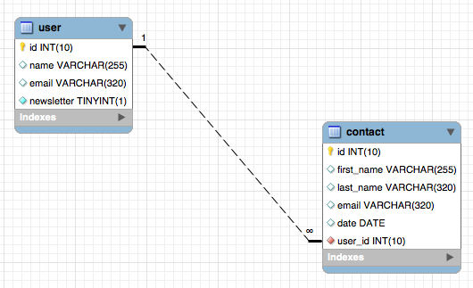

# Contact Tracer Application - Notes

The Frontend is served on the server-endpoint `/` and is an SPA powered by React.

**Requirements**

* Router System (with Registration) -> OAuth2
* Show Content only to authorized users
* Each user has its own data (contacts)
    * Add, Remove, Delete and Alter Data
        * (optional) allow only on own endpoint(s)
        * (optional) implement an administrator
    * Form to do so
    * Filtering contacts (frontend)
* State Management 
* Routes and Protected Routes

**Database**



`CREATE TABLE contact (id INT UNSIGNED NOT NULL AUTO_INCREMENT, first_name VARCHAR(255), last_name VARCHAR(320), email VARCHAR(320), date DATE, user_id INT UNSIGNED DEFAULT 0, PRIMARY KEY (id), FOREIGN KEY (user_id) REFERENCES user (id));`

**API Endpoints (Backend)**

Router System
* Router with Github: `/oauth2/authorization/github`
* Logout of any service (POST): `/logout` <!-- TODO: HTTP 404 Not Found Custom Error (Not found does not return any JSON Data!), same with /login --> 
* Authorization errors: `/error` <!-- TODO: HTTP 999 map to Not found -->
* Try To Access Data when unauthenticated: redirect to homepage with message you have to be logged in (see TODO in spring)

REST
* Root: `/api`
* contacts (this options be useful for an Admin): `/api/contacts{?page,size,sort}`
    * "all contacts" (5 contacts per page):  `/api/contacts?page=0&size=5`
        * option to sort: -> `&sort=date` or `&sort=date,desc`
    * list contact with id=1: `/api/contacts/1`
    
* users:
    * logged in user: `/user` (returns email)
    * get userid from user (by email): `/userid?email=loggedInUserEmail`
    * 1:n to contacts - get all contacts from user with id=1: `/api/users/1/contacts`
        * sadly, paging and sorting does not work here - have to implement it by myself
    * Add contacts for user with id=1 (POST + PUT):
        1. post to the contacts repo without Relation (just don't include the userId): POST `/api/contacts`
           - The data transmitted to axios should have the following norm:
            ````javascript
            data: {firstName, lastName, email, date}
            ````
        2. get reference of created resource: `const ref = req.data._links.user.href;`
        3. get the id of currently logged user (byEmail - se above endpoint)
        4. Set Relation using PUT: the data is the currently logged in user which is `/api/users/{id}`, 
           the url is the `ref` we saved earlier and the header has the following setting: `"Content-Type": "text/uri-list"`


* *API queries should be accessible via Relationships (HATEOAS principle)*

* *Implementing XSS and XSRF Protection*

* *Implement Try/Catch Blocks when doing requests from client -> Handle Errors with header status*

**Designing the store (Redux)**

Required npm packages:
* redux
* @reduxjs/toolkit
* moment
* reselect 
* react-redux

Reminder: Design of Redux:
```txt
(Event)  (Listener)
Actions - Reducer - Store
```

<!-- Remember that store is immutable - only via reducer after dispatching action alter state -->

State Design:

```javascript
{
  entities: {
    contacts: []
  },
  
  auth: {
    userId: "", 
    user: "" 
  },
  
  ui: {
    contacts: {
      query: "page=0&size=5", 
      sortBy: "firstName"
    }
  }
}
```

Goal: Store any state completely in redux (globally) BUT local state of temp form data (local state)

Structure of the files 

```txt

    store/
        configStore.js	        // our createStore() function  combined of entities, ui etc.
        reducers.js 		// combines the other reducers to "main" reducer (entities, auth and ui)
        middleware/             
        entities/
           reducers/
              contact.js
           entitites.js		// combines contact.js reducer to entities.js reducer
       auth/
          auth.js
        ui/
          ui.js
```

Router dispatching design:

// componentdidmount
Initially, try to load resources from /user endpoint -> if not allowed, user is unauthenticated (auth state is empty)
else he is logged in (set auth state)

Dispatch Action to login when user clicks on link: dispatch(loadLogin());

* onStart: loginRequested
* onSuccess: loginSucceeded
* onFailure: loginFailed

Possible Actions by the User (dispatch) when logged in:

* add a contact
* delete a contact
* update a contact (tmp contact - setcurrent, clearcurrent)
* filter contact
* clear filter
